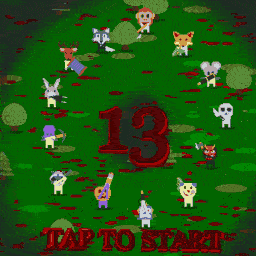

# ‍☠️ 13 ‍☠️

Fast-paced multiplayer top-down shooting game for [js13k 2022 competition](https://js13kgames.com/)

<p align="center">

</p>

- 🎖️ **7-th place** winner!
- 🥇 **1-st place** in **Server** category
- 🥉 **3-rd place** in **Mobile** category
- Check out [13 game post-mortem](https://eliasku.hashnode.dev/13-game)

## 📖 How to play

Select room, share the link and wait friends to play:

1. [Play on `🚪 grtc` | `🇪🇺 Europe`](https://grtc.herokuapp.com/)
2. [Play on `🚪 ga13` | `🇺🇸 US`](https://ga13.herokuapp.com/)

### 🎮 Controls

#### 🖱️Mouse | ⌨️ Keyboard
- Move Mouse to aim and look around
- Push Mouse button to shoot
- Use `W A S D` / `↑ ← ↓ →` to move
- Hold `Shift` to slow down moving
- Press `E` to drop the weapon
- Press `Space` to jump

#### 📱 Touch-screen
- Use Left Joystick to walk-run-jump
- Use Right Joystick to aim-shoot (Move around aim-shoot zones to trigger some weapons like Pistol)
- Use `DROP` button to drop the weapon

### 📜 Rules 

At spawn each Player or NPC has 10 hit points.

- Player kills neutral NPC to gain +1 score.
- Player kills another Player to gain +10 scores.

Kill opponents 💀 | 👹 | 🤡 | 🤖 | 🎃 | 🦝 | 🐙 | 🐰 | 🦌 | 🐺 | 🐵 | 🦊 | 🐭 | 🦍 to gain scores

Kill NPC 🍅 | 😐 | 🐷 to get scores

### Items

Destroy objects 🛢 | 📦 | 🪦 to get items

- ❤️ Heart: pick to restore 1`hp`

### Weapons

- 🔪 Knife (melee)
- 🪓 Axe (melee)
- 🔫 Pistol (trigger)
- 🖊 Machine-gun (auto)
- ️✏️ Heavy machine-gun (auto)
- 🪥 Shotgun (bouncing, scatter)
- ⛏ Crossbow (high velocity)
- 🔌 Plasma-gun (bouncing, auto)
- 🧵 Rail-gun (piercing)

## Minimal requirements

- **Good, low-latency network connection** is required for each playing client
- **Fast mobile device or desktop** to not lag other clients
- `NodeJS` 16 or higher is required for server
- WebAudio `AudioContext` support is required (available from Safari iOS 14.5, April 2021)
- WebGL context and instanced arrays ANGLE extension are required
- Modern JS syntax support
- Checked in the latest Chrome, Safari, Firefox on iOS, Android and Mac.

## 📦 Resources

Code for Music generation in runtime created by [author](https://twitter.com/eliaskuvoice). Some instrument samples are picked from [ZzFXM](https://keithclark.github.io/ZzFXM/) example song `Depp`

Emoji Font [Twemoji Mozilla](https://github.com/mozilla/twemoji-colr/releases) is used for cross-platform emoji rendering. Game is able to work without `e.ttf` file, but some icons are incorrect rotation angle, or different at all. But game should be playable anyway.

2D graphics rendering is started from [js13k-2d](https://github.com/kutuluk/js13k-2d) and highly rewritten for what I need.

Sound Effects - [ZZFX](https://github.com/KilledByAPixel/ZzFX).

## 💾 Build compression

Shaders are minified in TypeScript source code by [GLSLX - online minifier](https://evanw.github.io/glslx/)

1. [html-minifier](https://github.com/kangax/html-minifier) minifies `index.html`
2. [esbuild](https://github.com/evanw/esbuild) creates bundle from TypeScript source-code
3. Merge and rename properties which are non-overlapping in scope of Type.
4. [terser](https://github.com/terser/terser) is used to minify and mangle javascript files
5. Rehash properties for selected Web API classes (`WebGLRenderingContext`, `CanvasRenderingContext2D`, `AudioContext`, etc)
6. Pack client with [RoadRoller](https://github.com/lifthrasiir/roadroller) is used for final compression
7. Zip with [AdvanceCOMP](https://www.advancemame.it/comp-readme.html)

## Build instructions

```shell
npm i
npm run build
npm run start
```

Navigate to [localhost:8080](http://localhost:8080)

Use `npm run build --debug` to generate `debug.js` and `index4.html` / `debug4.html` to enable testing 4-players on a page.

Use `npm run build --rr --max` to enable road-roller compression

