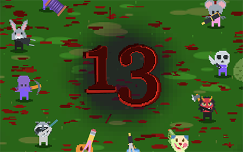
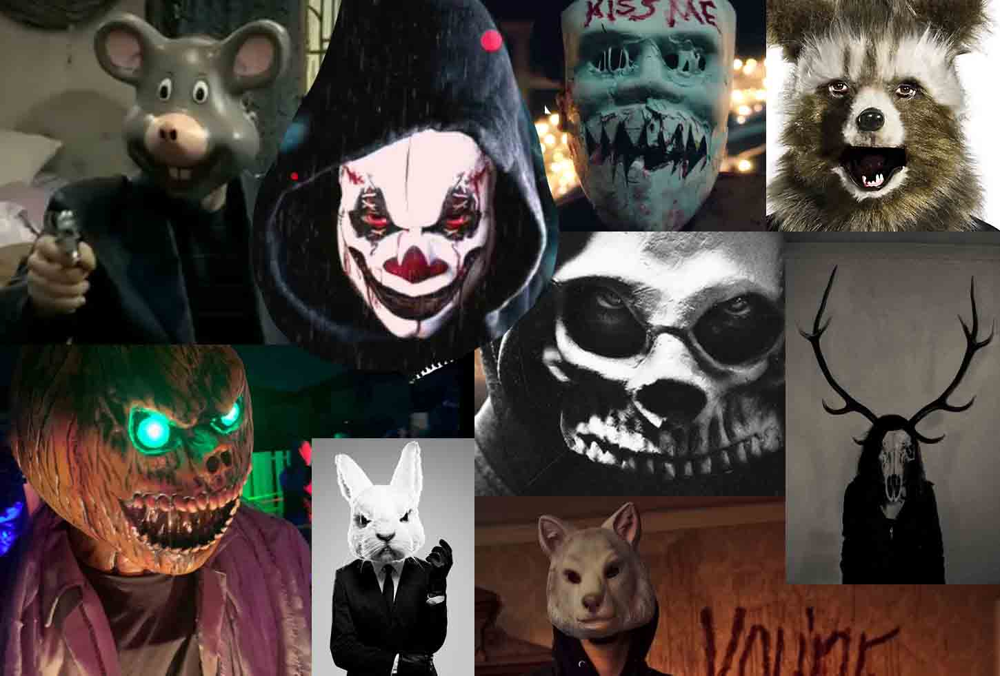

Первый раз решил принять участие в конкурсе [js13k 2022](https://js13kgames.com/).

В итоге получилась [игра "13"](https://js13kgames.com/entries/13) - это быстрый многопользовательский top-down shooter в режиме реального времени.

## Цели

Личной целью я поставил себе ещё до оглашения темы. Я хотел реализовать peer to peer многопользовательскую игру в реальном режиме времени. Я никогда ещё не делал таких проектов, но давно интересуюсь их реализацией.

## Тема - Смерть

Несколько дней обдумывал что-нибудь оригинальное в плане геймплея, что могло бы лучше раскрыть тему. В итоге решил, что чем проще, тем лучше и начал фокусироваться вокруг идеи "Bullet-Hell". Я понял, что если я использую Emoji для лиц персонажей, то это могло бы быть похожи на макси психопатов-убийц и я вспомнил про серию фильмов Судная Ночь. 

Конечно для тактики многопользовательской игры было бы круто сделать городскую или пригородную локацию, но учитывая что в размере и времени я ограничен, я определился что дело будет происходить на милой лесной полянке, что впринципе может вызвать правильные ассоциации с триллерами, где убийцы выслеживают и гоняются за героями по ночному лесу. По поводу освещения я был настроен скептически, но к концу у меня хватило воли реализовать простейший "туман войны", что улучшило картинку в целом.

Вдохновлялся Nuclear Throne для механики стрельбы, и Hotline Miami с точки зрения стиля (небрежный пиксель в высоком разрешении без фильтрации), а так же струи крови и пятна на карте.

Я люблю платформеры, но принимая во внимание, что интереснее будет писать в другом жанре - я остановился на жанре top-down shooter.

Думал если повезёт - то дам чёртово название "13" и сделаю 13 персонажей и 13 видов оружия, но с оружием немного не успел.

## Сеть

Использую WebRTC для быстрого обмена данными без подтверждения и без сохранения порядка отправки.

Архитектурно я использую схему Lock-step - игрок ждут пока от всех игроков придут информация о вводе на тик, и только потом мы можем проиграть этот тик. Полный детерминизм игровой логики. Для предотвращение мелких лагов я использовал схему с перекрытием отправляемых команд. Игрок назначает командам ввода время выполнение немного забегая вперёд (delayed input), несмотря на задержку отзыва на клиенте в несколько кадров мы имеем возможность гладко накапливать (буфферизировать) команды на клиентах для предотвращение постоянного попадания в холодное состояние (когда не хватает ввода для симуляции тика).

В качестве Signalling server я не использовал web-sockets, а реализовал более простой обмен данными по HTTP через fetch + EventSource. Сервер держит текущие подключения и даёт клиентам возможность обмениваться простыми сообщениями друг с другом, один клиент отправляет команду адресованную другому клиенту на сервер, а сервер через серверное событие отправляет это сообщение получателю. На мой взгляд получилось наиболее компактно по сравнению с web-sockets.

Я умышленно не делал сложную обработку проблем с подключением, дропом игроков, отслеживанием наибольшего лага, процедуру кика лагающего игрока и тому подобное в целях предотвратить увеличение размера кода. В данном проекте я сфокусировался на удачном сценарии подключения.

## Графика

Использовал WebGL для отрисовки методом instancing. За основу взял js13k-2d и постепенно перемешивал код. Удалил всё что связано с alpha-discard и z-buffer, добавил color-offset для эффекта попадания. Альфа компонент color-offset использую как коэффициент выбора normal blend / additive blend (классическая техника с использованием premultiplied-alpha).

Для более эффективного сжатия все необходимые GL константы перенесены в `const enum`.

Финальный шейдер минифицировал с помощью GLSLX.

Изначально лужи крови и гильзы просто лежали на карте и копились, что замедляло отрисовку, поэтому я в какой-то момент превратил фон карты в FBO и начал отрисовывать накопленные частицы на жту поверхность.

Освещение изначально думал сделать через сетку, но быстро понял что кода будет много, второй шейдер я добавлять не хотел, в итоге решил попробовать рисовать источники света в текстуру. Для источника света в отдельную текстуру сгенерировал мягкий шар с градиентом альфа-канала. Включил режим смешивания который вычитает альфу у приёмника `blendFunc(GL.ZERO, GL.ONE_MINUS_SRC_ALPHA)`. Дальше с апскейлом и выключенной фильтрацией рисую эту текстуру поверх всего. Получился эффект "тумана войны" и визуально видны квадратики, как будто бы я это делаю через тайловую сетку.

Все игровые спрайты я сразу рисую в атлас, простые квадратики, кружки, элементы виртуального джойстика. Все emoji я рисую во временный канвас и потом уменьшаю в ячейку атласа, сделано это для достижения большей пикселизации emoji. Почти каждый спрайт в атласе обрезается альфа, чтобы достичь жестких пиксельных границ объекта.  

## Музыка и звуки

Изначально я взял то, что всегда было перед глазами - SFXR для эффектов и SoundBox для музыки. Перенеся по-быстрому код в чистый Typescript и загрузив стандартные звуки и музыкальный трек я понял, что меня уже неплохо ограничило по размеру. А мне еще нужно было сделать симуляцию панорамного аудио: балансировать звук между левым и правым каналом, а так же вычислять громкость в зависимости от расстояния от источника звука.

И сразу я кинул силы на оптимизацию размера кода и эффективности хранения данных для звуков. Сделал препроцессинг параметров для SFXR, чтобы убрать некоторые вычисления в генерации звуков, что дало действительно хороший результат.

В итоге всё равно музыка и звуки мешали добавлять новый функционал и я нашёл ИДЕАЛЬНУЮ библиотеку ZZFX и ZZFXM, смысл музыкального плеера заключается в том, что используются ZZFX семплы для инструментов, что убирало дублирование кода для генерации звука для эффектов и для музыкальных дорожек. Долгое время я тестировал с музыкальным треком Depp из примеров ZZFXM. 

К завершению проекта я планировал что у меня в запасе есть около 200 байт, которые я заберу за счет того что напишу короткий мощный трек сам, в трекере, или по крайней мере ВЫРЕЖУ паттерны из используемого трека. В итоге я тыкался в трекере, никакие музыкальные идеи я не смог реализовать. Я понимал что музыкальный плеер и сам трек будет занимать около 500 байт. Места мне уже не хватало...

Это была паника и я решил попробовать другой подход - процедурную генерацию музыки используя в те же ZZFX семплы. Взял минорную гамму и начал накидывать цикл проигрывания баса, и как всегда помощь и вдохновение пришло от любимой супруги, в какой-то момент один из запусков она узнала в бас линии трек Justice, после чего всё встало на свои места с ритмическим рисунком, я добавил сольники, бас-бочку, хеты, добавил вариативности с задержкой, добавил эквалайзер на басс-линию и автоматизировал её параметры случайным образом. В результате это **заняло меньше 100 строчек кода на TypeScript!** 

Результатом очень доволен. Если бы было больше времени, то возможно я бы добавил отдельно 2 трека, один для заставки, а второй уже для игры.

Дальше в последний момент я добавил простейший синтез речи, который приветствует и комментирует процесс игры. Это тоже добавило разнообразия.

## Производительность

Для сокращения размеров каждую симуляцию я выполняю множество создания массивов, клонирую объекты и тому подобное. Несмотря на то, что это должно вызвать сильную нагрузку на сборщик мусора и на создание новых объектов - игра работает на современных мобильных устройствах в 60 FPS. В последствии, я думаю, это можно будет легко оптимизировать добавив функций которые делают все эти вещи inplace, пулы объектов и тому подобное.

Что действительно необходимо было оптимизировать в первую очередь - это найти только видимые объекты и только потом отсортировать их по глубине для отрисовки.

Так же к сожалению проверку столкновений нужно было оптимизировать в начале проекта, вместо полного перебора по архитипу объекта, необходимо было сразу использовать разбиение по сетке, чем максимально снизить кол-во пар для проверки. Т.к. мы выполняем симуляцию 1 и более тиков за кадр - это очень сильно помогло после завершения проекта. Так же показало что вариант с loose-grid в размер 13k всё таки без проблем помещается.

## Сжатие кода

Современный EcmaScript и его фишки. Использовал только типы без лишней вложенности. Массивы функций вместо `switch`.

Стандартный пайплайн для сборки:
1. Напрямую собираем TypeScript в один файл с помощью esbuild. Здесь включена минификацию синтаксиса, которая меняются `const` -> `let`. Здесь же выкидываем `console.*`.
2. Слияние полей типов
3. Прогоняем через terser, здесь всё включено по-максимуму
4. Делаем API Hashing, заменяем использование выбранных API, подставляем вычисленный словарь для переменных.
5. Используем Roadroller для крашинга 
6. Создаём архив с максимальными настройками сжатия

#### Слияние полей между типами
Слияние типов перед mangle props. Мы можем использовать TypeScript типизацию чтобы определить что все типы не используются вместе, таким образом мы назначаем полям одинаковые имена, что позволяет terser выбрать для них одинаковые идентификаторы, что само собой приводит к уменьшению общего используемого словаря в коде. К моему удивлению в 2022 году до сих пор нет инструмента, которые бы минифицировали код на уровне TypeScript учитывая строгую типизацию.

#### Хеширование АПИ
Мы не можем переименовать web api функции, но мы можем создать для них в рантайме ссылки с более короткими названиями.
1. Получаем все свойства которые мы будем использовать для конкретных классов.
2. Вычисляем такой SEED при котором сокращенные HASH значения не будут пересекаться в рамках каждого типа. 
3. Генерируем словарь и сортируем его с учетом кол-ва использований идентификаторов в минифицированном кодом.
4. Подставляем словарь в финальную сборку

## Чтобы я делал в следующий раз

1. Использовал бы `js13k server sandbox` для категории Server. Я просто не читал правила в самом начале, тк не думал что есть отдельная категоря для multiplayer игр. Однако мой сервер получился настолько простым и миниатюрным, что я не видел смысла переводить всё на server sandbox за 12 часов до отправки проекта. Еще один момент по которому я переживал, что игра не будет работать на js13kgames.
2. Я бы сразу делал fixed-timestep игровой цикл, я бы сразу начинал дизайн ядра в целочисленных координатах.
3. Я рекомендую с самого начала проекта интегрировать вопрос "Загружать Emoji?", т.к. когда у меня всё было готово, я уже в стрессе боролся с размером, тк перевес оказался на 3 байта. В такой момент не хочется заниматься оптимизациями в тех местах, которые уже протестированы, поэтому пришлось пересмотреть код инициализации и добавить дополнительное состояние, чтобы убрать одну условную ветку.
4. Уже после отправки проекта я поменял систему проверки столкновений с обычного n^2 перебора на хеширование пространства обычной нестрогой сеткой, что оказалось очень серьёзной оптимизацией для симуляции дополнительных тиков в режиме предсказания (когда нам недостаточно событий от других игроков). В оригинальном проекте к сожалению сильное забегание вперёд может приводить к низкому FPS.
5. Писал бы черновики для этого отчёта по мере реализации проекта.

## Хотелки
- Опыт и прокачка в процессе игры, смысле копить опыт и случайным образом получать улучшения характеристик 
- Механика патронов
- Механика перезарядки
- Второй слот для оружия (менять)
- Гранатомёт, гранаты, взрывы бочек
- Лазерный пулемёт
- Ножницы (бумеганг или множественное отражение)
- Генерация интересной тайловой карты для большей тактики
- Игровые комнаты: подключится в случайную комнату и создание приватных комнат
- Поддержка Gamepad 
